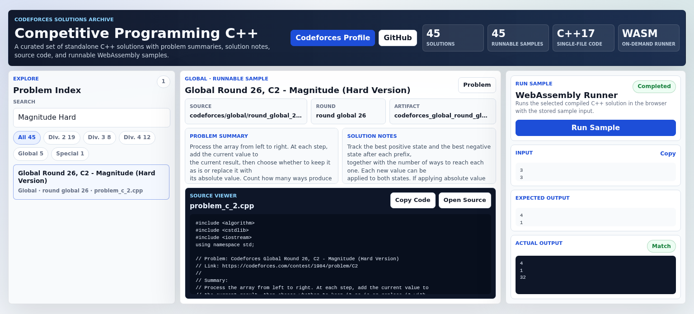

# Competitive Programming C++

A collection of standalone C++ competitive programming solutions with
problem summaries, solution notes, source code, and runnable sample tests.

**Live demo:** [mrcodecx.github.io/competitive_programming_cpp](https://mrcodecx.github.io/competitive_programming_cpp/)



## About

This repository collects competitive programming solutions written in C++. Each
solution is a single-file program with metadata embedded in comments: the
original problem link, a short problem summary, and an explanation of the
approach used.

The static site turns that metadata into a searchable solution explorer. It can
also run the compiled WebAssembly version of each included solution against a
stored sample input and compare the actual output with the expected output.

## Features

- 45 Codeforces solutions.
- Standalone C++ source files.
- Problem links, summaries, and solution explanations extracted from source
  comments.
- Search and division filters for browsing the archive.
- Integrated source-code viewer.
- WebAssembly sample runner loaded on demand per solution.
- Stored sample input and expected output for every runnable solution.
- Known-issue solutions are kept in the repository but excluded from the
  runnable static-site manifest.

## Repository Structure

```text
.
|-- codeforces
|   |-- div_2
|   |-- div_3
|   |-- div_4
|   |-- global
|   |-- known_issues
|   `-- special
|-- site
|   |-- app.js
|   |-- data
|   |-- index.html
|   |-- screenshots
|   |-- src
|   `-- style.css
|-- README.md
`-- LICENSE
```

## Running A Solution Locally

Each solution can be compiled as a normal C++ program:

```bash
g++ -std=c++17 -O2 codeforces/div_4/round_952/problem_a.cpp -o solution
./solution < input.txt
```

## Static Site Data

The site uses generated data files:

```text
site/src/solutions.json
site/src/sample_tests.json
site/data/sources.json
```

The WebAssembly builds are emitted as ES modules under:

```text
site/src/wasm/
```

Because those modules use dynamic `import()`, the site should be opened through
GitHub Pages or a local static server rather than directly through `file://`.

## Codeforces Profile

[ThMrCode](https://codeforces.com/profile/ThMrCode)

## License

MIT License. See [LICENSE](LICENSE).
